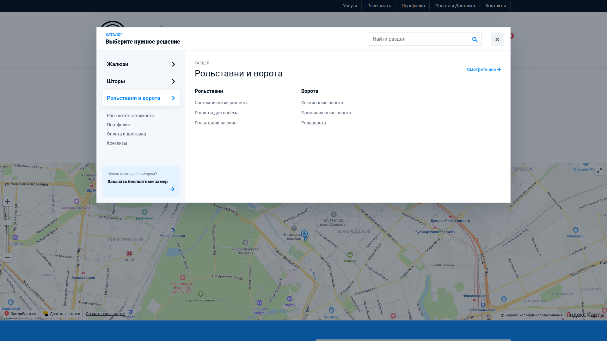
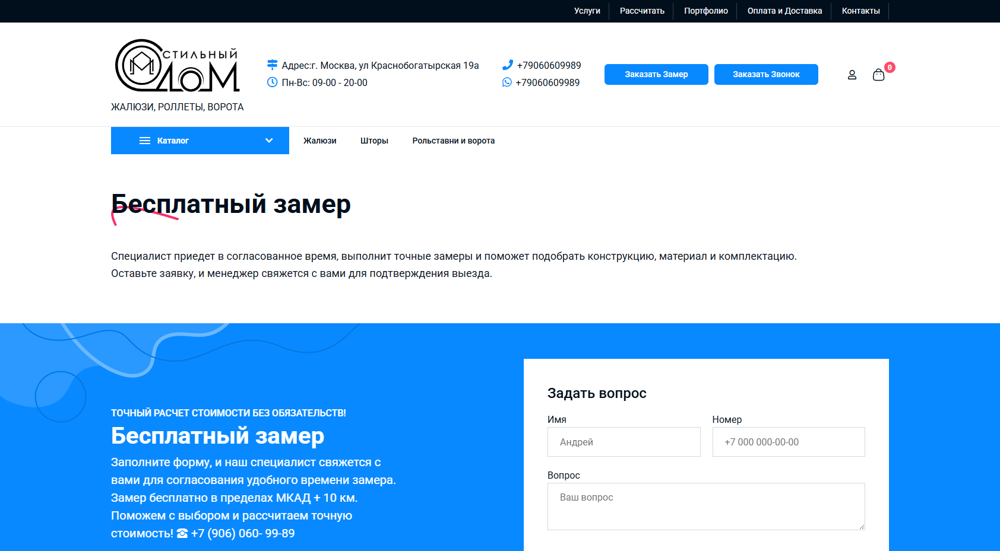
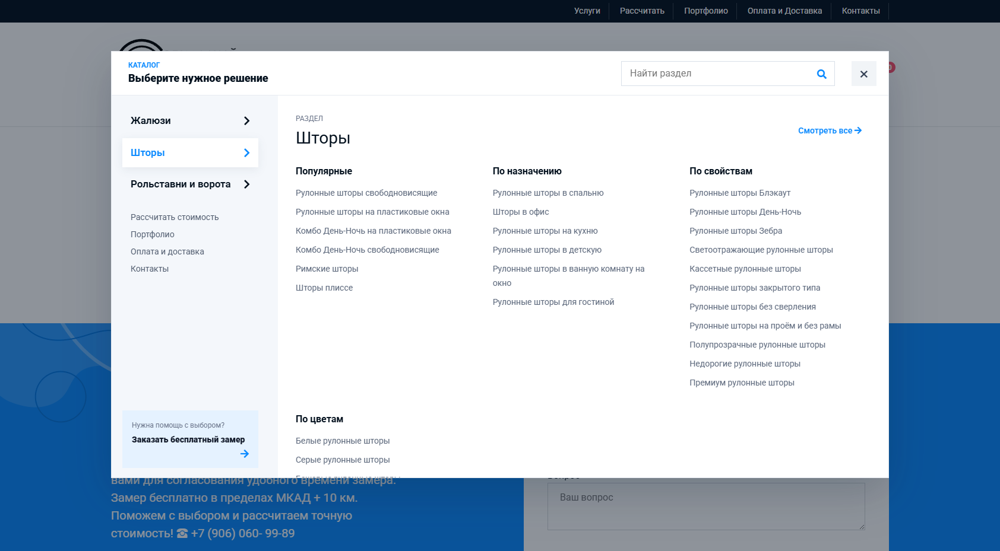
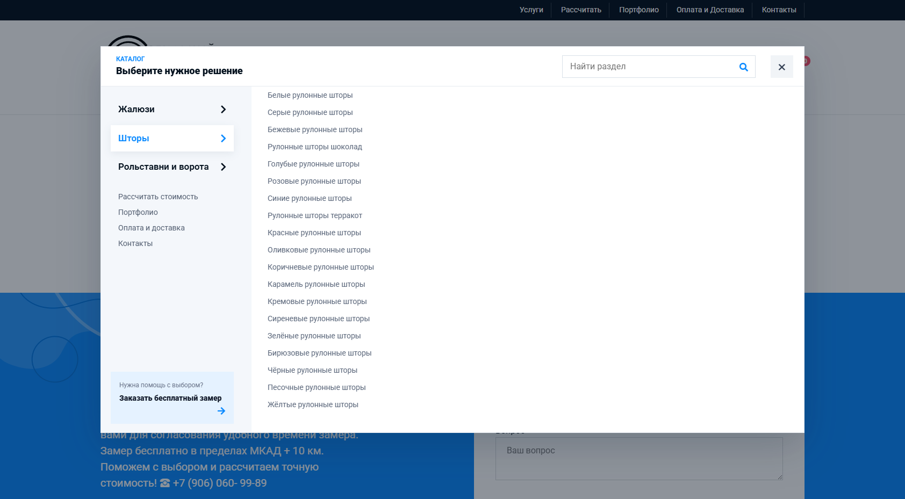

# Отчет по меню, перелинковке и скорости

Дата проверки: 30.07.2026  
Сайт: https://stylish-house.net/

## Что сделано

- Реализовано новое мегаменю каталога под структуру сайта: «Жалюзи», «Шторы», «Рольставни и ворота».
- В меню добавлены тематические группы и ссылки на SEO-подкатегории. Проверено 73 уникальных URL: все открываются без ошибок 4xx/5xx.
- В админке добавлен визуальный редактор структуры меню: вкладки, группы, ссылки, порядок и активность элементов можно менять без правки шаблонов.
- Дерево меню кэшируется и не загружает товары при каждом открытии страницы.
- Для карточек товаров meta description формируется с названием конкретного товара, без изменения сохраненных метатегов категорий.
- Карта Яндекса переведена на отложенную загрузку, подключения Google Fonts объединены, удалены повторные запросы меню к базе.
- Исправлена относительная ссылка на декоративное изображение формы, из-за которой на внутренних страницах возникал 404.
- Восстановлены отсутствовавшие служебные страницы верхнего меню без перезаписи существующего контента.

## Проверка интерфейса

Меню проверено в реальном браузере на трех размерах:

- desktop: 1920 x 1080;
- mobile: 390 x 844;
- mobile: 360 x 800.

Проверены открытие и закрытие, переключение вкладок, поиск по пунктам, мобильные аккордеоны, блокировка прокрутки фона и отсутствие горизонтального переполнения.

### Desktop 1920 x 1080

### Исправление длинного меню 1684 x 929

Убрана дублирующая стрелка кнопки «Каталог». Для длинных разделов добавлена независимая вертикальная прокрутка: меню сохраняет высоту окна, а все ссылки доступны без обрезания страницы и горизонтального скролла.

### Mobile 390 x 844

### Mobile с открытым разделом

### Mobile 360 x 800

## Скорость

Лабораторный замер Lighthouse выполнен после публикации изменений.

| Режим | Performance | FCP | LCP | Speed Index | TBT | CLS | TTI |
|---|---:|---:|---:|---:|---:|---:|---:|
| Mobile, до работ | 36 | 2,8 с | 6,0 с | 9,3 с | 3280 мс | 0,006 | 31,0 с |
| Mobile, после работ | 82 | 2,8 с | 3,4 с | 4,1 с | 210 мс | 0,004 | 10,8 с |
| Desktop, до работ | 54 | 1,5 с | 2,4 с | 3,2 с | 500 мс | 0,013 | 6,9 с |
| Desktop, после работ | 88 | 1,3 с | 1,7 с | 1,7 с | 0 мс | 0,012 | 1,7 с |

Дополнительно после публикации:

- ответ главного HTML-документа: 450 мс mobile / 370 мс desktop;
- консоль контрольной страницы: 0 ошибок, 0 предупреждений;
- горизонтальное переполнение меню: отсутствует.

## Автоматические проверки

- PHP: 22 теста, 142 проверки, все пройдены на отдельной тестовой базе `stylish_house_audit_test`.
- JavaScript: 11 тестов, все пройдены.
- Production build: собран успешно, 379 модулей.
- Интеграционные тесты редактора подтверждают права администратора, транзакционное сохранение структуры и очистку только кэша меню.

## Резервная копия

До начала работ создана и проверена резервная копия базы и кода:

`/var/www/www-root/data/backups/stylish-house/20260729-232540`

Контрольные суммы архива и дампа проверены до публикации.
